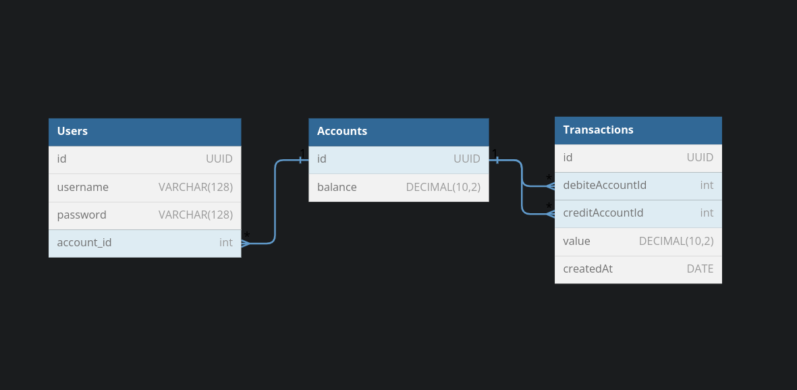

<h1 align="center">
  MyCash
</h1>

<p align = "center">
Projeto backend para a aplicação MyCash - uma aplicação onde é possível se cadastrar e realizar transações financeiras e gerar um registro das mesmas. Cada usuário pode se cadastrar utilizando um nome de usuário e uma senha, e automaticamente é criada uma conta vinculada a seu nome com um saldo inicial, assim ele pode realizar transferências para outros usuários cadastrados utilizando o username do destinatário.
O projeto faz a criação do banco de dados com as tabelas necessárias para a criação e leitura de usuários e suas transferências.
</p>

<blockquote align="center"></blockquote>

<h3 align= "center">
  Tecnologias&nbsp;&nbsp;&nbsp;&nbsp;&nbsp;&nbsp;
</h3>

<p align="center" >
  As tecnologias utilizadas no projeto foram: Typescript | PostgreSQL | Express | Typeorm | Class Transformer | Error Global | Docker.
</p>

A API possui 7 Eendpoints, sendo os principais de criação de usuário, transferência e leitura de seus históricos.


Diagrama de relacionamentos:



<br />
<br />

<h3 align= "center">
  Instruções para instalação da aplicação&nbsp;&nbsp;&nbsp;&nbsp;&nbsp;&nbsp;
</h3>

Primeiro crie um arquivo **".env"** seguindo o modelo do arquivo **".env.example"** para gerar as variáveis de ambiente necessárias.

Para a instalação das dependencias do projeto, o usuário deve acessar a pasta raiz, e no terminal utilizar o comando de execução dos gerenciador de dependências utilizado.

- yarn install <br/>

Após as instalações, é necessário criar os containers, utilizando o seguinte comando:

- docker-compose up

O próximo passo é rodar as migrations, comandos que geram as tabelas necessárias no banco de dados.
Essas migrations devem ser executadas dentro do container da api. 

<br />

Em outro terminal rode os seguintes comandos:

- docker exec api yarn typeorm migration:generate src/migrations/createTable -d src/data-source.ts
- docker exec api yarn typeorm migration:run -d src/data-source.ts

<br />

A api também possui testes, que podem ser rodados com o comando:

- yarn test


<br />

### **Endpoints**

## Rotas do Usuário

```json
[{ "baseurl": "https://localhost:3000" }]
```

<h2 align ='center'> Criando um Usuário </h2>

`POST /users/register`

```json

{
	"username": "User 1",
	"password": "Pass0123"
}

```

<h2 align ='center'> Resposta de sucesso </h2>

`FORMATO DA RESPOSTA - STATUS 201`

```json
{
	"id": "1a9f73d7-ebbb-4416-9637-2730c386ebb9",
	"username": "User 1",
	"balance": "100.00"
}
```


<h2 align ='center'> Possíveis erros </h2>

Caso você acabe errando e mandando algum campo inválido, como a senha no exemplo da resposta abaixo, a resposta de erro será assim:

` FORMATO DA RESPOSTA - STATUS 400`

```json
{
  "message": "A senha deve ter pelo menos uma letra minúscula, uma letra maiúscula, um número e 8 caracteres!"
}
```

Caso o usuário já exista.

` FORMATO DA RESPOSTA - STATUS 404`

```json
{
  "Error": "Já existe um usuário com este username."
}
```


<h2 align ='center'> Buscando um Usuário </h2>

`GET /users/:id`

<h2 align ='center'> Resposta de sucesso </h2>

Caso o token do usuário seja o do titular da conta, a resposta incluirá a identificação de sua conta.

`FORMATO DA RESPOSTA - STATUS 200`

```json
{
	"id": "1a9f73d7-ebbb-4416-9637-2730c386ebb9",
	"username": "User 1",
	"account": {
		"id": "ec057a58-ba8a-41b4-b6d9-ea061e3eaba0"
	}
}
```


<h2 align ='center'> Possíveis erros </h2>

Caso você não seja o o proprietário:

` FORMATO DA RESPOSTA - STATUS 403`

```json
{
  "message": "Usuário não autorizado!"
}
```

<h2 align ='center'> Deletando um Usuário </h2>

`DELETE /users/:id`

<h2 align ='center'> Resposta de sucesso </h2>

Caso o token do usuário seja o do titular da conta.

`FORMATO DA RESPOSTA - STATUS 204`


<h2 align ='center'> Possíveis erros </h2>

Caso você não seja o o proprietário:

` FORMATO DA RESPOSTA - STATUS 403`

```json
{
  "message": "Usuário não autorizado!"
}
```

Caso não haja token:

` FORMATO DA RESPOSTA - STATUS 401`

```json
{
  "message": "Invalid token"
}
```


Caso o usuário ainda possua saldo em sua conta:

` FORMATO DA RESPOSTA - STATUS 403`

```json
{
  	"message": "O usuário ainda possui saldo em sua conta."
}
```


<h2 align ='center'> Realizando uma transferência </h2>
Para o envio de uma transferência deve ser informado um nome de usuário e o valor a ser transferido. O valor deve ser no mínimo de 3 números, incluindo os centavos.

`POST /transactions`

```json
{
	"usernameAddressee": "Destinatário",
	"value": 100
}
```

<h2 align ='center'> Resposta de sucesso </h2>

`FORMATO DA RESPOSTA - STATUS 200`

```json
{
	"transferId": "82747c12-2d92-43cc-86eb-cb0205bfa1f6",
	"createdAt": "Tue Nov 22 2022 11:32:43 GMT+0000 (Coordinated Universal Time)",
	"value": "1.00",
	"debitedUser": "User 1",
	"creditedUser": "Destinatário"
}
```

Caso não haja saldo suficiente.

`FORMATO DA RESPOSTA - STATUS 406`

```json
{
  "Error": "Saldo insuficiente para transferência."
}
```

<h2 align ='center'> Listando transferências </h2>

Listar todas as transferências.

`GET /transactions - FORMATO DA RESPOSTA - STATUS 200`

```json
[
	{
		"id": "8fc16b2a-bd04-4109-a5d5-ed840683ecd3",
		"createdAt": "2022-12-19T13:01:59.090Z",
		"debited": "User 1",
		"credited": "Destinatário",
		"value": "50.00"
	},
	{
		"id": "a62979a6-9103-4685-b8ec-de5eb2513dc5",
		"createdAt": "2022-12-19T13:02:11.384Z",
		"debited": "Destinatário",
		"credited": "User 1",
		"value": "26.00"
	}
]
```

Também é possível istar transferências por enviadas (cash-out) e recebidas (cash-in).

`GET - /cash-in` ou `/cash-out  - FORMATO DA RESPOSTA - STATUS 200` 
 

```json
[
	{
		"id": "8fc16b2a-bd04-4109-a5d5-ed840683ecd3",
		"createdAt": "2022-12-19T13:01:59.090Z",
		"debited": "User 1",
		"credited": "Destinatário",
		"value": "10.00"
	},
	{
		"id": "a62979a6-9103-4685-b8ec-de5eb2513dc5",
		"createdAt": "2022-12-19T13:02:11.384Z",
		"debited": "User 1",
		"credited": "Destinatário",
		"value": "6.00"
	}
]
```

Também é possível existe o filtro de transferências por data. Que pode ser feito com o modelo abaixo.

`GET /transactions/:year/:month/:day`

`FORMATO DA RESPOSTA - STATUS 200`

```json
[
	{
		"id": "8fc16b2a-bd04-4109-a5d5-ed840683ecd3",
		"createdAt": "2022-11-22T13:01:59.090Z",
		"debited": "User 1",
		"credited": "Destinatário",
		"value": "15.00"
	},
	{
		"id": "a62979a6-9103-4685-b8ec-de5eb2513dc5",
		"createdAt": "2022-11-22T13:02:11.384Z",
		"debited": "User 1",
		"credited": "Destinatário",
		"value": "27.00"
}
]
```

Caso a data seja maior do que o atual, a resposta será assim.

`FORMATO DA RESPOSTA - STATUS 406`

```json
{
  "message": "A data informada não pode ser maior do que a atual!"
}
```

